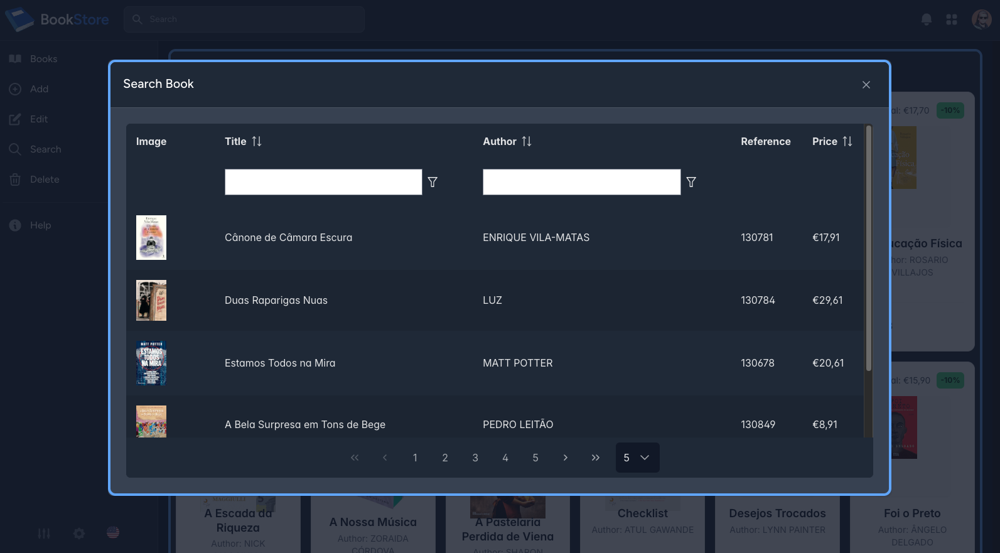

# Laravel as a Docker on render.com

Building a Project with Laravel + Breeze + Inertia + React + Docker + Apache + SQLite

# Commands

```

-- Create App

composer create laravel/laravel .

composer require laravel/breeze --dev

npm i

php artisan breeze:install react

php artisan migrate:fresh

php artisan db:seed

php artisan key:generate

-- Edit composer.json 

"require": { 
    "ext-pdo_sqlite": "*",
    "ext-sqlite3": "*"
}

composer update
npm run build

-- Composer

composer require symfony/clock:^7.0 symfony/css-selector:^7.0
composer update
change /laravel-docker/composer.lock where are "php": "^8.4", to 8.2

-- Run Bankend

php artisan serve --port=8080
php artisan serve

-- Run Frontend

npm run dev

-- Flowbite UI

npm i -S flowbite-react
npm i -D flowbite-typography
npm i -S tailwind-merge lucide-react tw-animate-css

-- Primereact UI

npm i -S primereact

-- Icons

npm i -D flowbite-react-icons @iconify-icon/react iconsax-react react-icons primeicons

-- Inertia

npm i -S @inertiajs/inertia

-- Docker

docker build -t laravel-docker -f Dockerfile .

docker run -itd \
--restart unless-stopped \
--name laravel-docker \
--hostname laravel-docker.local \
-p 80:80 \
laravel-docker

-- Git

git add -f storage/app/private/books

```

# CRUD

```
php artisan make:model Book -mcr
php artisan migrate:rollback
php artisan migrate
php artisan migrate:fresh

tail -n 50 storage/logs/laravel.log

php artisan tinker
use App\Models\Book;
Book::create(['title' => 'It works']);
Book::all();

php artisan make:seeder BooksSeeder
php artisan migrate:fresh
php artisan db:seed --class=BooksSeeder

```

# Web Interface

http://127.0.0.1:8080/





# Demo

https://laravel-docker-1kqh.onrender.com/

https://dashboard.render.com/

# Links

https://flowbite.com/icons/

https://flowbite-react.com/

https://flowbite.com/blocks/

https://icon-sets.iconify.design/

https://react-icons.github.io/react-icons/icons/hi/